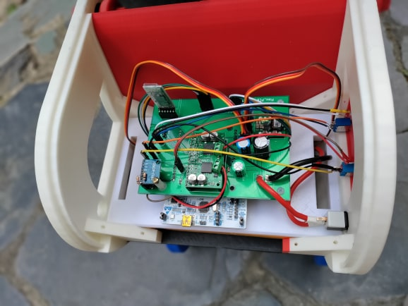
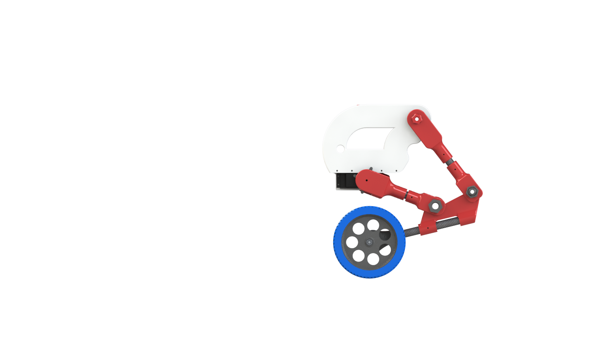
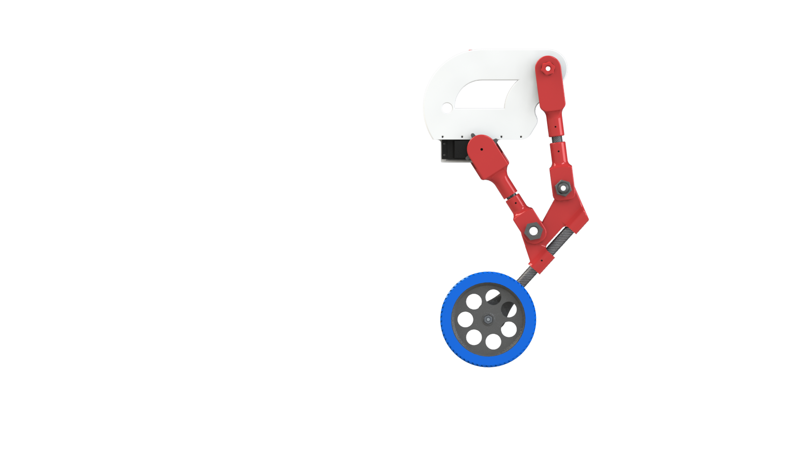

# FLEX: The Wheeled Bipedal Legged Self Balancing Robot

FLEX is a wheeled bipedal legged self-balancing robot developed as part of a Master’s project in Advanced Systems and Robotics. The goal of the project is to apply concepts from our studies to control a nonlinear and unstable system, specifically an inverted pendulum, and make it balance autonomously. This project involved the design and implementation of control systems, sensor integration, and motor control using the STM32 Nucleo board.

## Features
### Autonomous Balance and Navigation: 
FLEX uses advanced control algorithms to balance and navigate autonomously without manual intervention.
### PID Control: 
Initially, the robot used a Proportional-Integral-Derivative (PID) control system to maintain balance.
### LQR Control:
An LQR (Linear Quadratic Regulator) control system is being implemented to enhance the stability and performance.
### Sensor Integration: 
Utilizes accelerometers, gyroscopes, and encoders for precise measurement of orientation, position, and velocity.
### STM32 Nucleo Board: 
The project is powered by an STM32 Nucleo board, which offers a robust environment for control system implementation and sensor data processing.

## Hardware

### Main Components
#### Microcontroller: 
STM32 Nucleo board.
#### Sensors:
##### Accelerometer-Gyroscope module for measuring angular position and velocity.
##### Encoders : 
on the wheels for measuring position and velocity.
##### Motors: 
DC motors with sufficient torque to balance the robot.
##### Power Supply:
A DC-DC buck converter is used to regulate the voltage from the battery to the required levels for the motors and electronics.

### Other Components: 
#### Passive components :
like resistors, capacitors, potentiometers for tuning PID gains, switches, and LEDs for indications.

## Control Systems

Solarized dark             |  Solarized Ocean
:-------------------------:|:-------------------------:
  |  

### PID Control
#### Tuning: 
Potentiometers are used to manually tune the PID coefficients (Kp, Ki, Kd).
#### Functionality:
The PID control is responsible for calculating the motor duty cycle based on the error in the robot’s balance.
#### Anti-windup: 
An anti-windup mechanism is implemented to prevent integral term divergence.

### LQR Control
#### State Vector:
Utilizes sensor data to form the state vector required for LQR.
#### Gain Calculation: 
The gain matrix Klqr is calculated using a linearized model of the system.
#### Current Control Loop: 
A PI controller is used to regulate motor current to achieve the desired torque.

## Software
The software for FLEX is developed using the Mbed framework. Key functionalities include:

### Sensor Data Acquisition: 
Filtering and processing sensor data using a Kalman filter for accurate state estimation.
Control Algorithm Implementation: Implementation of both PID and LQR control algorithms.
### Motor Control: 
Functions to control the direction and speed of the motors based on the control signals.
### Autonomous Navigation: 
Algorithms for autonomous navigation and obstacle avoidance.

## Project Development
### Initial Phase
#### Simulation: 
MATLAB was used to simulate the inverted pendulum model and test various control strategies.
#### Prototype: 
A prototype (V1) was developed to test the feasibility of the design and control strategies.
### Current Phase
#### Improved Design: 
Based on the learnings from V1, a second version (V2) is being developed with more powerful motors and an optimized control system.
LQR Implementation: Transitioning from PID to LQR control to improve stability and performance.
### Challenges
#### Stability: 
Ensuring the robot remains stable under different conditions.
Sensor Fusion: Accurately combining data from different sensors to estimate the state of the robot.
Control Tuning: 
Finding the optimal parameters for the control algorithms to achieve smooth and stable performance.
### Future Work
#### Complete LQR Implementation: 
Finalize and test the LQR control system.
Enhanced Autonomous Navigation: 
Improve the algorithms for obstacle detection and avoidance.
#### Robustness: 
Increase the robustness of the system to handle more varied environments and disturbances.

## Conclusion
FLEX represents a significant step in the development of autonomous self-balancing robots. By leveraging advanced control techniques and robust hardware components, this project aims to create a versatile and reliable robotic platform for future research and applications in robotics.