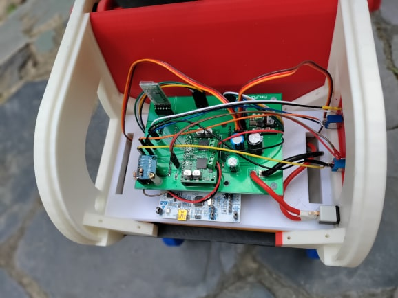
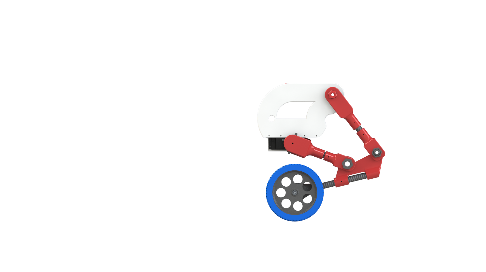
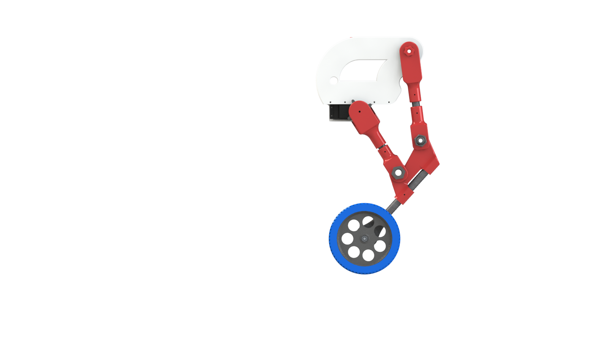
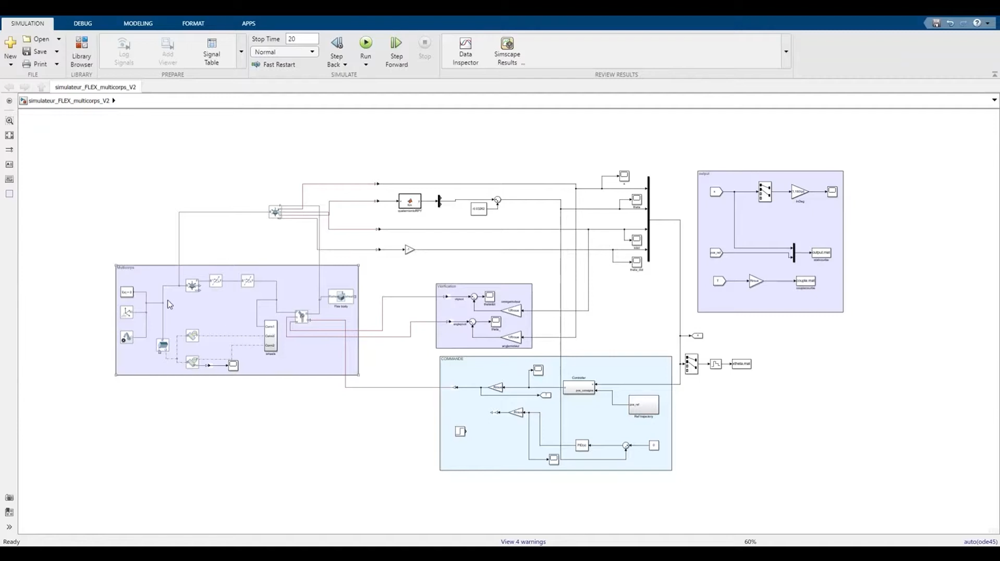
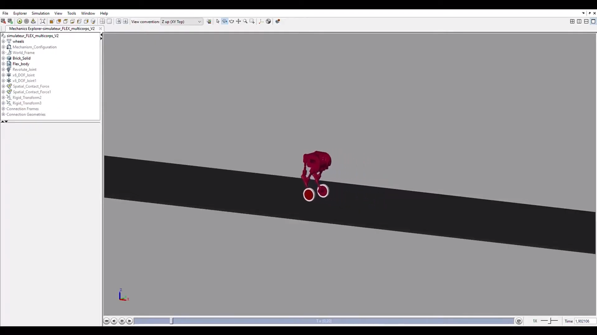
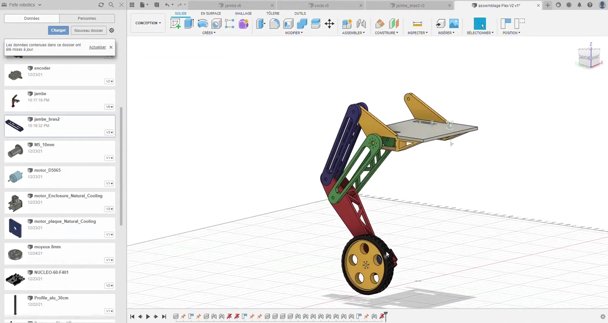

# FLEX: Wheeled Bipedal Self-Balancing Robot

[](https://youtu.be/Me2IMcmEs_o)

FLEX is a wheeled bipedal self-balancing robot (inverted-pendulum control) built as part of a
Master's project in Advanced Systems and Robotics, plus a ROS2/Gazebo digital twin built on top
of it. The real robot runs a cascaded PID balance loop on an STM32 Nucleo board; the digital twin
simulates the same kinematics in Gazebo Harmonic behind a hardware-abstraction layer designed to
one day drive the real robot through the same ROS2 graph.

## Try the simulation (2 commands)

```bash
git clone <repo-url> && cd Flex-MultiModal-Balancing-Robot
./scripts/setup.sh   # builds the ROS2 Jazzy + Gazebo Harmonic Docker image
./scripts/demo.sh    # launches Gazebo + RViz2 with the robot spawned
```

Requires Docker Desktop running, and (on Windows) WSL2 with WSLg for GUI passthrough — run
`demo.sh` from inside your WSL2 distro, not a native Windows shell. Once running:

```bash
docker exec -it flex-v3-demo bash -c "source /opt/ros/jazzy/setup.bash && source /ws/install/setup.bash && ros2 topic list"
```

shows the live ROS2 graph (`/joint_states`, `/imu_sensor_broadcaster/imu`,
`/diff_drive_controller/odom`, `/tf`). The robot model is currently box/cylinder primitives, not
CAD-accurate meshes — see [Known limitations](#known-limitations--honest-status) below.

## Repository structure

| Path | What it is |
|---|---|
| `firmware/` | Deployed STM32 mbed firmware — the actual balance control loop, unchanged by the ROS2 work |
| `flex_description/`, `flex_gazebo/`, `flex_control/`, `flex_hardware/`, `flex_msgs/` | ROS2 Jazzy packages: robot model, Gazebo world/spawn, `ros2_control` controllers, hardware-abstraction interfaces, custom messages |
| `flex_simulink/` | Wraps the MATLAB/Simulink LQR controller model (`PendulumCartSim.slx`); future home of a ROS Toolbox-generated ROS2 node |
| `matlab_archive/` | Offline MATLAB/Simulink work: LQR derivation, 2D/multi-body simulators, the unexported SolidWorks CAD part |
| `odrive/` | Configuration for the unbuilt V2 motor stage (ODrive torque control) |
| `future_work/human_tracking_system/` | Exploratory camera-based human tracking, not integrated with the balance controller |
| `docs/architecture/` | Architecture docs — hardware, control, simulation, software, deployment — written to be honest about what's deployed vs. designed-only |
| `scripts/` | `setup.sh` (build image), `demo.sh` (run demo), `entrypoint.sh` (container entrypoint) |

## Hardware (V1, deployed)



- **Microcontroller:** STM32 Nucleo, mbed-os, bare-metal (no RTOS)
- **IMU:** MPU6050 — on-chip DMP does the sensor fusion (no custom Kalman/complementary filter)
- **Encoders:** quadrature wheel encoders, nominal 64 ticks/rev × 30:1 gearbox
- **Motor driver:** MC33926 dual H-bridge with analog current sense
- **Leg actuators:** 2x RC servo for the sit/stand deploy mechanism
- **Wireless tuning:** Bluetooth UART, single-char protocol; 3 potentiometers for live Kp/Ki/Kd tuning

Full inventory and block diagram: [`docs/architecture/hardware_architecture.md`](docs/architecture/hardware_architecture.md).

## Control systems

Flex Down             |  Flex UP
:-------------------------:|:-------------------------:
  |  

**Deployed:** a cascaded PID — an outer PD loop on wheel position/velocity produces a tilt
setpoint (clamped ±5.5°), tracked by an inner PID on IMU pitch that outputs motor PWM duty
(clamped ±0.8). A `|pitch| > 30°` threshold triggers a stop + state reset. Gains are
live-tunable via Bluetooth or onboard potentiometers.

**Designed, not deployed:** a 4-state LQR (`[x, ẋ, θ, θ̇]`) derived in `matlab_archive/LQR.m`.
The gains were never transferred to firmware — rather than retrofit live hardware, the dormant
LQR design is being revived as a parallel ROS2/Simulink demonstration running against the Gazebo
digital twin instead. See [`docs/architecture/control_architecture.md`](docs/architecture/control_architecture.md)
for the full reasoning, including why `diff_drive_controller` and ODrive torque-control mode were
chosen over alternatives that would have created competing control loops.

## MATLAB/Simulink & CAD design

`matlab_archive/Multi-Body_Simulator/simulateur_FLEX_multicorps_V2.slx` is a multibody physics
validation model — it imports the robot's rigid-body structure, drives it with the same PID
control law conceptually as the firmware, and is paired with the SolidWorks CAD part
(`FLEXmatlab-Corps volumiques.SLDPRT`) for body geometry/inertia.

Simulink block diagram (multibody dynamics + verification + PID command blocks):



Mechanics Explorer animation of the same model — the robot balancing on a virtual track:



Mechanical CAD assembly (leg + wheel subassembly, motor/encoder/Nucleo mounts):



This CAD work is the design source for the robot's real geometry; it hasn't yet been exported to
STL/STEP and wired into the Gazebo URDF (see [Known limitations](#known-limitations--honest-status)),
so the box/cylinder primitives in the digital twin are a placeholder for this actual design.

## Architecture docs

- [`hardware_architecture.md`](docs/architecture/hardware_architecture.md) — component inventory, block diagram, CAD-to-sim mesh pipeline
- [`control_architecture.md`](docs/architecture/control_architecture.md) — PID vs LQR, Simulink codegen plan, ODrive control mode rationale
- [`simulation_architecture.md`](docs/architecture/simulation_architecture.md) — sim/real topic parity, fidelity caveats
- [`software_architecture.md`](docs/architecture/software_architecture.md) — ROS2 package graph, data flow, package responsibilities
- [`deployment_architecture.md`](docs/architecture/deployment_architecture.md) — what works today vs. what's designed-only, recruiter demo workflow

## Known limitations / honest status

- The Gazebo robot model uses box/cylinder primitives, not real CAD meshes — no SolidWorks export
  has been done yet ([`flex_description/meshes/README.md`](flex_description/meshes/README.md)).
- The balance control law (PID/LQR) is not running in Gazebo today — the digital twin exposes
  kinematic-level topics (`/cmd_vel`, `/odom`, `/joint_states`, `/imu`), not a closed balance loop.
- The STM32 serial bridge and ODrive torque-control node are designed but not implemented — both
  require hardware access that isn't currently available.
- Two pre-existing firmware issues are carried forward, not fixed, per the constraint that the
  deployed balance algorithm isn't touched: a left/right encoder CPR float/int mismatch, and
  `balanceControl()` being invoked from both a Ticker and the main loop. Details in
  [`deployment_architecture.md`](docs/architecture/deployment_architecture.md#known-issues-carried-forward-from-the-original-firmware-audit).

## License

MIT — see [`LICENSE`](LICENSE).
