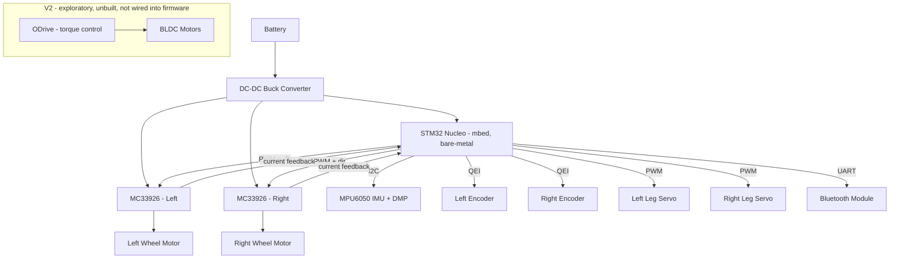

# Hardware Architecture

## Inventory (verified against `firmware/src/main.cpp` and `odrive/ODrive_Configuration_Script.txt`)

| Component | Part / Detail | Interface |
|---|---|---|
| MCU | STM32 Nucleo (exact part not pinned in repo), mbed-os, bare-metal (no RTOS) | — |
| IMU | InvenSense MPU6050, on-chip DMP does sensor fusion | I2C (`D14`/`D15`) |
| Wheel encoders | Quadrature (QEI), nominal 64 ticks/rev × 30:1 gearbox | GPIO (`D2`/`D3`, `A4`/`A5`) |
| Motor driver (V1, deployed) | MC33926 dual H-bridge, analog current sense | PWM + analog (`A2`/`A3`) |
| Motor driver (V2, exploratory, unbuilt) | ODrive, pole_pairs=7, encoder cpr=8192, torque-control mode | USB (odrivetool) |
| Leg actuators | 2x RC servo (sit/stand deploy mechanism) | PWM (`A0`/`A1`) |
| Wireless link | Bluetooth UART, 9600 baud, single-char tuning protocol | UART (`D0`/`D1`) |
| Tuning input | 3x potentiometer (Kp/Ki/Kd) | AnalogIn |

Wheel radius `Rroue = 0.072 m`, wheelbase `≈ 0.280 m` — both hardcoded in firmware and MATLAB
scripts; this is the only dimensional ground truth currently available (no BOM/schematic exists).

## Hardware Block Diagram

## CAD-to-Sim Pipeline (for `flex_description` mesh/inertia accuracy)

No STL/STEP export of the robot CAD exists yet — only the raw SolidWorks part
`matlab_archive/Multi-Body_Simulator/FLEXmatlab-Corps volumiques.SLDPRT` (19MB, unexported).
This blocks accurate Gazebo visual/collision meshes today, so V3 sequences around it:

1. **Now:** `flex_description` uses box/cylinder primitives sized from the known dimensions
   above and proportions read off `Images/FLEX_assis.png` / `FLEX_debout.png`. Mass is a rough
   estimate (weigh the physical robot); inertia tensors are computed analytically for the
   primitive shapes (`I = m·(h²+d²)/12` for boxes, standard cylinder formulas for wheels). These
   are flagged `PLACEHOLDER` in `flex_description/config/flex_inertials.yaml`.
2. **Future, requires SolidWorks access (currently unavailable):** open the `.SLDPRT`, assign
   real material densities per body, use SolidWorks' **Evaluate → Mass Properties** tool to read
   exact mass/COM/inertia tensor per body directly (no export needed for this step).
3. **Future, same session as #2:** File → Save As → STL (visual/collision meshes) and STEP
   (archival/interchange) into `flex_description/meshes/`; replace primitives in the URDF/Xacro
   with the real meshes (collision geometry stays primitive — meshes are bad collision geometry
   regardless of fidelity).

This sequencing is itself a deliberate process decision, not an oversight: it unblocks all
simulation and ROS2 architecture work immediately while keeping the CAD-accuracy task as a
clearly-scoped, non-blocking follow-up.
