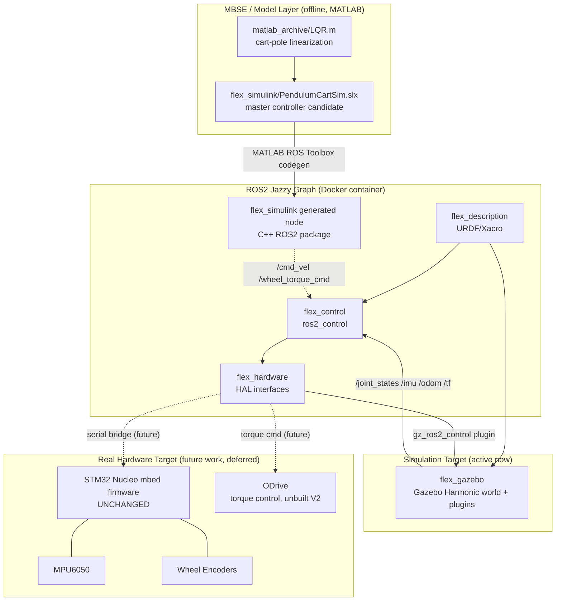
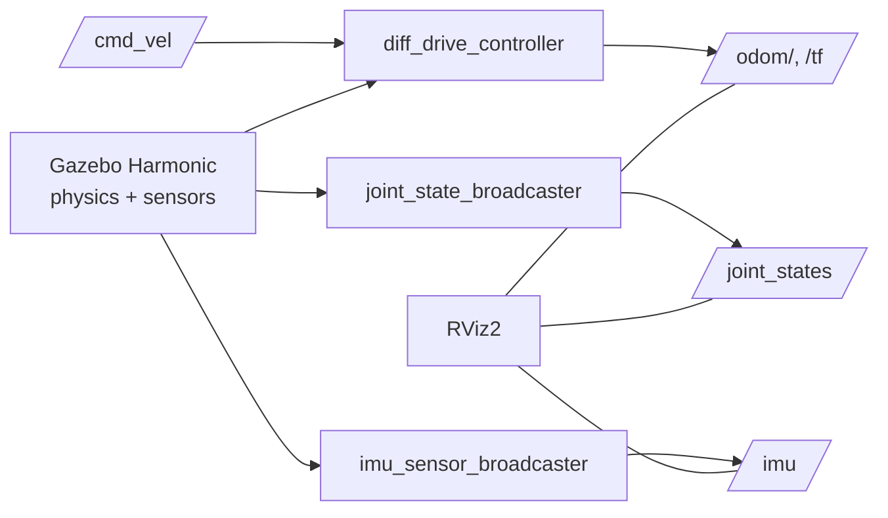

# Software Architecture

## ROS2 Package Graph

## Runtime Data Flow (simulation path — the active demo path today)

## Package Responsibilities

| Package | Build type | Responsibility |
|---|---|---|
| `flex_description` | `ament_cmake` | URDF/Xacro robot model: base, wheels, legs, IMU. Source of truth for kinematics/visuals. |
| `flex_gazebo` | `ament_cmake` | Gazebo Harmonic world, spawn/demo launch files, `ros_gz_bridge` topic config. |
| `flex_control` | `ament_cmake` (pluginlib) | `controller_manager` config: `joint_state_broadcaster`, `imu_sensor_broadcaster`, `diff_drive_controller`, `leg_position_controller`. |
| `flex_hardware` | `ament_cmake` | Hardware abstraction layer — same ROS2 graph drives sim or real robot via a launch-time `hardware_type` param. |
| `flex_simulink` | `ament_cmake` | Wraps `PendulumCartSim.slx`; future home of MATLAB ROS Toolbox-generated C++ controller node. |
| `flex_msgs` | `ament_cmake`/`rosidl` | Custom messages: `WheelTorque`, `EncoderTicks`, `MotorCommand`, `LegCommand`. |

## Execution Model Note

This layer does **not** change the balancing control algorithm in `firmware/src/main.cpp`. It
adds a parallel, ROS2-native graph that (a) simulates the robot's kinematics/dynamics in Gazebo
and (b) is designed to eventually observe/command the real firmware at its existing sensor-in/
PWM-out boundary, without touching the cascaded PID or the (currently dormant) LQR code paths.
